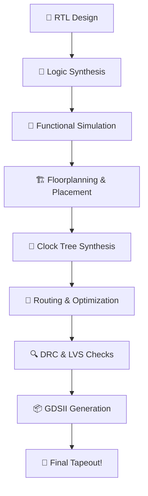

#  From Silicon to Sovereignty: RISC-V SoC Tapeout Journey

<h2>
  - By IIT Gandhinagar x VSD 🧠🔧
</h2>

Welcome to my journey in the **RISC-V SoC Tapeout Program** — an ambitious national initiative by **IIT Gandhinagar** and **VLSI System Design (VSD)**, backed by India's semiconductor vision of **"One Tapeout Per Student"** 🚀.

> 🎯 *"This isn’t just learning VLSI. It’s building silicon, and with it, building India’s future in semiconductors."*

---

## 📌 Overview

- 🧩 **Duration**: 20 Weeks  
- 🧠 **Focus**: From RTL ➡️ Physical Design ➡️ GDSII ➡️ 🚀 Tapeout  
- 🔧 **Tools Used**: 100% Open-Source  
- 🛠️ **Skills Gained**: Industry-grade SoC Design Experience  
- 🧑‍🤝‍🧑 **Collaboration**: 3500+ Participants, 100s of Institutions  
- 🏛️ **Mentors & Contributors**: Professors, Chip Architects, and Visionaries  

---

## 🛠️ Week 0 – Environment Setup & Tools

> This week laid the groundwork for our entire SoC design journey. We prepared our local environments and installed the complete open-source EDA stack.

<strong>🔍 Tools Setup and First Steps</strong>

### ✅ Installed Tools

| Tool           | Purpose                                  | Verified |
|----------------|-------------------------------------------|----------|
| 🧠 Yosys        | Logic synthesis & RTL optimization         | ✔️       |
| 📟 Icarus Verilog (iverilog) | Functional simulation of designs       | ✔️       |
| 📊 GTKWave      | Visualizing waveform outputs               | ✔️       |
| ⚡ Ngspice       | Mixed-signal circuit simulation           | ✔️       |
| 🎨 Magic VLSI    | Layout editor and DRC checker             | ✔️       |
| 🛠️ OpenLane     | Full RTL2GDSII open-source flow           | ✔️       |
| 📦 Netgen       | LVS verification                          | ✔️       |

📂 All tool installation steps are documented in [`Week0/`](Week0/)

---

## 🎓 Semiconductor Chip Design Flow

---

## 📊 Progress Tracker

| Week | Theme                      | Status     | Highlights                          |
|------|----------------------------|------------|-------------------------------------|
| 0    | 🛠️ Tools Setup             | ✅ Done    | OpenLane, Magic, Yosys, GTKWave     |
| 1    | 🧬 RTL Design Basics       | ⏳ Ongoing | Functional Design, Verilog Structure |
| 2    | 🔍 Simulation & Debugging  | 🔜         | Waveform Analysis using GTKWave     |
| ...  | …                          | 🔜         | …                                   |
| 20   | 🎯 Final Tapeout Submission| 🔜         | GDSII and sign-off!                 |

## 🤝 Program Impact

| 💡 Vision                      | 🛠️ Implementation                                 |
|-------------------------------|--------------------------------------------------|
|  **National Sovereignty**   | Self-reliant chip design ecosystem               |
| 🧑‍🎓 **Democratized Learning**| Free, open-source workshops by VSD              |
| 🏭 **Industry-Aligned**       | Direct experience with Tapeout methodology       |
| 🌐 **Open Collaboration**     | 3500+ designers across India                     |
| 🧰 **Hands-on Skills**        | RTL → Layout → Verification → Tapeout 🚀        |

---

## 👨‍🏫 Mentors & Contributors

### 🙏 Heartfelt thanks to all the visionaries guiding this initiative:

| Name                      | Role                                  |
|---------------------------|----------------------------------------|
| 🧠 Dr. Rajat Moona        | Director, IIT Gandhinagar              |
| 🎓 Prof. Tarun Agarwal    | Faculty & Program Support              |
| 📐 Prof. Joycee Mekie     | SoC Design Guidance                    |
| 🔬 Prof. Nihar R. Mohapatra | Digital Systems Mentor               |
| 🧑‍🏫 Prof. Madhav Pathak  | RTL/PD Education Support               |
| 🔧 Samir Patel            | India Semiconductor Mission            |
| 🧙‍♂️ Mohamed Kassem      | Founder, ChipFoundry & Efabless        |

---

## 🧩 Ecosystem & Enablers

| Organization                       | Contribution                              |
|------------------------------------|-------------------------------------------|
| 🔧 **VSD (VLSI System Design)**    | Program Platform & Hands-on Workshops     |
| 🌍 **RISC-V International**        | Open ISA Standardization                  |
| 🏢 **India Semiconductor Mission** | National Strategy & Ecosystem Support     |
| 🧪 **ChipIN Centre**               | Infrastructure & Tool Access              |
| 🏭 **VLSI Society of India (VSI)** | Knowledge & Industry-Academia Bridge      |
| 🔗 **Efabless**                    | Open MPW Tapeout Platform                 |

---

## 📢 Call to Action

> 💥 *"This is more than skilling. It’s nation-building."*

If you're passionate about chip design and want to shape the future of India's semiconductor story — this is your moment. 🌟

- 🔗 [Apply for Future Cohorts](https://vsdiat.vlsisystemdesign.com/)
- 🎥 [Explore VSD Courses](https://www.vlsisystemdesign.com/)
- 🔍 [Follow RISC-V International](https://riscv.org/)

---

## 👨‍💻 About Me

| Field         | Info                                                  |
|---------------|-------------------------------------------------------|
| 💻 **GitHub** | [KARTIKAY](https://github.com/Kartikay-W-21-22-24/) |
| 🧑‍🎓 **Role** | Participant in RISC-V SoC Tapeout Program             |
| 🛠️ **Interests** | Digital Design, SoC Architecture, RTL-to-GDS        |
| 🌟 **Goal**   | Tapeout a working silicon chip 🚀                    |

---

## ⭐ Star & Fork This Repository

If you find my journey insightful or want to follow along, consider giving this repo a ⭐ and feel free to fork it for your own tapeout journey!

---

 &nbsp;&nbsp;&nbsp;   **Jai Hind | जय हिन्द** &nbsp;&nbsp;&nbsp;   

🧠 *"From bits to chips — let's build silicon that builds the nation."*

 

